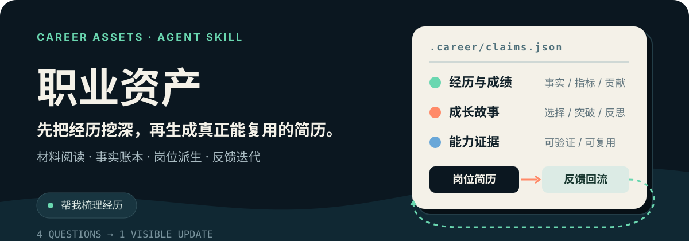

<p align="center">
  
</p>

<p align="center">
  <strong>不要让一堆简历文件管理你的职业事实。</strong>
</p>

<p align="center">
  一个以外层 PDCA 和内层操控循环组织事实、定位、岗位交付、面试准备与反馈回流的 Career Harness。
</p>

## 从经历发现到岗位交付

先读材料、递进深访、分轮确认，再把经历沉淀为长期文档。`career-assets` 管理阶段和依赖，`career-evidence` 负责让用户把经历想起来、讲清楚：

```text
材料阅读与顾问式深访
→ 用户确认与 claims 事实账本
→ content/Knowledge/Outputs/职业经历.md
→ opportunity 岗位映射
→ 简历／自我介绍／面试包
→ 投递与面试反馈
→ 下一轮调整
```

具体子任务由五个 sibling Skill 完成：

| Skill                | 职责                                            |
| -------------------- | ----------------------------------------------- |
| `career-evidence`    | 经历深挖、分轮确认、职业经历文档、claims 与证据 |
| `career-positioning` | 长期定位、JD 映射、项目选择与 gap               |
| `resume-package`     | 岗位简历、自我介绍与 DOCX                       |
| `interview-package`  | 项目讲法、具体回答、追问与口语化                |
| `career-retro`       | 投递／面试反馈分类与下一轮动作                  |

## 双层循环

外层 PDCA 管理一次求职机会的完整阶段：

```text
capture → verify → position → package → practice → apply → retro
```

每个子 Skill 再运行自己的内层循环：

```text
前馈 Guides → 行动 → Sensors → 调整 Steer
```

失败时只回到对应环节：缺证据不靠润色解决，岗位不匹配不靠堆关键词解决，口语超时也不反向删除事实。

## 状态不是笔记

Career Harness 默认在 Git 根目录使用 `.career/`：

```text
.career/
├── config.json
├── claims.json
├── positioning.json
├── feedback.jsonl
├── manifests/
└── opportunities/<opportunity_id>/
    ├── opportunity.json
    ├── outputs/
    └── manifests/
```

- `claims.json` 保存结构化事实与证据；`content/Knowledge/Outputs/职业经历.md` 是长期维护的人类可读文档。
- 通过 `config.paths.career_history` 定位文档；写入前核对人工补充，确认后同步到账本，不用生成覆盖用户修改。
- `.career/manifests/career-history.json` 记录正文的 claim 依赖；未解决的事实修改或未同步内容保持 stale。
- `positioning.json` 保存基于 claims 的定位与待补问题。
- 每个岗位产物用 manifest 记录 claim IDs。
- 每个岗位拥有独立自我介绍，不覆盖全局基础版。
- 真实反馈可以改变定位、选择和表达，但不能直接篡改事实。

## 经历挖掘的节奏

- 材料多先读出摘要与缺口，材料少先建立粗时间线。
- 紧急机会优先挖当前岗位相关经历，长期整理优先挖重要但没讲清的经历。
- 一次问一到两个递进问题，每约四个关键问题整理小结，让用户纠偏、继续深挖或先服务岗位。
- 没有数字不编百分比；用户疲惫或已经能支持当前目标时收口。
- `positioning.open_questions` 保存未解问题，下一次“继续补充”承接上轮。
- 初始化只配置文档路径，首轮授权保存经历时才创建文档和 manifest。

## 状态工具

初始化：

```bash
python career-assets/scripts/init_state.py --root <git-root>
```

验证：

```bash
python career-assets/scripts/state_lint.py --state-dir <git-root>/.career --repo-root <git-root>
```

影响扫描：

```bash
python career-assets/scripts/impact_scan.py \
  --state-dir <git-root>/.career \
  --claim-id <claim-id>
```

机会状态：

```bash
python career-assets/scripts/opportunity_status.py \
  --state-dir <git-root>/.career \
  --opportunity-id <opportunity-id>
```

## 从一句人话开始

```text
帮我梳理经历
帮我按这个岗位出一版
帮我准备面试
继续补充
复盘投递/面试
```

用户不需要理解 claim、manifest 或状态机。外层 Skill 会确定阶段并路由正确的子 Skill。

## 事实边界

- 只有 confirmed claim 可以进入保真简历和面试回答。
- 课程、旧简历和旧讲稿只能提供线索或参考框架。
- 用户明确确认整组项目文稿为事实时，记录这项确认；个人职责、事故、客户和数字仍分别判断。
- 面试简历示例数字、客户目标和理论能力不会自动成为个人成果。
- 岗位文案和市场反馈不能反向升级为事实。

## 岗位交付

每次岗位机会使用独立目录：

```text
.career/opportunities/<opportunity_id>/outputs/
├── resume.md
├── resume.docx              # 用户明确要求时
├── self-introduction.md
└── interview-plan.md
```

DOCX 模板和 OfficeCLI 规则位于 `resume-package`；技术面试口语化规则位于 `interview-package`。

## 仓库内容

```text
career-assets/          外层控制器、状态规范和计算型 Sensors
career-evidence/        事实采集与验证
career-positioning/     定位和岗位映射
resume-package/         岗位简历与 DOCX
interview-package/      面试材料与口语化
career-retro/           反馈回流
```

---

<p align="center"><strong>先让事实可追踪，再让每次求职都成为下一轮的输入。</strong></p>
