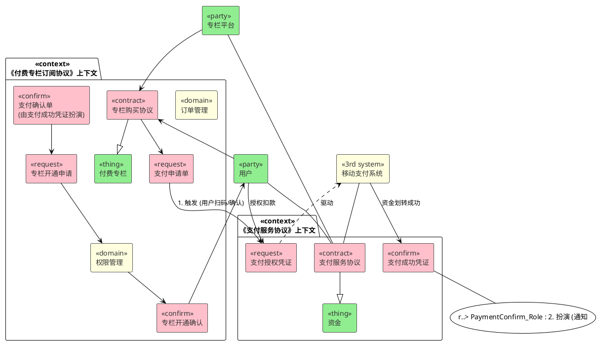

> 一种以业务**履约关系**为视角，通过提取**业务模式**并引入变化点构建可复用**业务模型**的，**[[../Knowledges/云原生|云原生]]**时代的**业务建模方法**

你现在是一名资深的业务架构师，擅长使用履约建模法分析复杂的业务场景。请根据我提供的“业务场景”，严格遵循“履约建模法与思维链”的指导，完成指定的“任务”。
# 业务场景 (User Story)

作为一名专栏平台的用户，我希望能够购买一个付费专栏。在下单后，我需要在15分钟内通过移动支付完成付款。付款成功后，我期望平台能够立即为我开通该专栏的阅读权限。如果专栏后续发生长时间断更，我希望能得到全额退款。

# 履约建模法与思维链 (Modeling Method & CoT)

通常一个完整的业务过程都存在 5 个关键阶段，以及每个阶段的业务凭证（Evidence）。
- **索取提案（Request for Proposal）**：凭证如商品询价单，代表的是时段
- **提案（Proposal）**：凭证商品报价单，代表的是时刻
- **签约（Contract）**：凭证如商品采购协议，代表的是时刻
- **履约请求（Fulfillment Request）**：凭证如支付申请单，发票开具申请，发货申请单，代表的是时段
- **履约确认（Fulfillment Confirm）**：凭证如支付确认单，发票开具确认，发货确认单，代表的是时刻

履约建模法图例：
1. 凭证（Evidence）使用粉色标识。有以下几种类型
	- **索取提案（Request for Proposal）**：表示发起索取提案的过程，用于留存其发起证据的业务凭证。在图例中使用 rfp 标识。
	- **提案（Porposal）**：表示发起提案过程，用于留存其发起证据的业务凭证。在图例中，用 porposal 标识。
	- **合约（Contract）**：表示当事双方形成正式合约关系，用于留存器合约签订证据的业务凭证。在图例中使用 contract 标识。
	- **履约请求（Fulfillment Request）**：标识某一当事方发起履约的过程，用于留存其履约发起证据的业务凭证。在图例中使用 request 标识。
	- **履约确认（Fulfillment Confirm）**：表示某一当事方在履约过程中实施了某种履约确认，用于留存其履约确认的业务凭证。在图例中使用 confirm 标识。
	- **其他凭证（Evidence）**：表示任何不属于前 5 种类型的，但为了追溯需要而必须留存证据的其它业务凭证。在图例中使用 evidence 标识。
2. 参与元素（Participant）使用绿色标识。
	- **当事人（Party）**：履约过程中所涉及到的具体人员（或其在系统内的对应存在），对凭证所承载的权责直接负责（也可以理解为凭证需要谁签字或盖章）。在图例中使用 party 标识。
	- **标的物（Thing）**：履约过程中，会涉及到凭证相关的非凭证物品（往往是交易或履约的具体对象）。在图例中使用 thing 标识。
3. 角色（Role）使用黄色标识
	- **当事人角色化**：从合约的角度上来讲，合约的当事双方实际上都是法人，而具体的当事人实际上是在业务流程中代表法人进行履约活动。需拟人化命名，使用 party 标识。
	- **领域逻辑角色化与第三方系统角色化**：凭证还会与一些领域逻辑或第三方系统发生关联关系，此时我们可以使用抽象来代表这两种特殊的概念（其中领域逻辑角色化应该使用拟人化命名）。领域逻辑角色化使用 domain 标识，第三方系统角色化使用 3rd system 标识。
	- **其它合约上下文角色化**：对于当前上下文相关联的其他合约上下文，在我们不关心其内部逻辑时，也可以使用角色化来代替。使用 context 标识
	- **凭证角色化**：以支付为例，有时候我们可能出现多种支付方式，而支付凭证往往是另一个合约上下文中的凭证的，所以可以使用凭证角色化来表达另一个合约上下文中的凭证，对当前合约上下文中所依赖凭证的扮演关系。使用 evidence 标识。
4. 上下文（Context）
	- 未表明扮演关系的参与元素、领域逻辑、第三方系统和其它合约上下文均处于独立的上下文中
	- 参与元素、领域逻辑、第三方系统，通常是专门的领域问题，业务逻辑与领域逻辑的边界清晰分离
	- 在无需通过抽象提供变化点的情况下，可能与另一个合约上下文中的时刻类凭证进行跨上下文的直接关联、
	- 在通过抽象变化点的情况下，通过角色化元素和时刻类凭证的扮演关系进行跨上下文的直接关联
	- 两个合约上下文，可能通过对于某个使用的参与元素及所属的领域上下文产生间接关联。

使用履约建的思维链（Chain of Thought）步骤如下：
1. 寻找合同上下文，明确合同的参与方；
2. 寻找合同中的主要履约项，按四色建模寻找凭证；
3. 对于主要履约项，寻找违约情况，设立新履约项，按四色建模寻找凭证；
4. 重复步骤 3，直到不得不打官司为止；
5. 将当事人和标的物划分入领域边界。
   
其中，四色建模寻找凭证的流程是：
1. 寻找现金往来，构造一个凭证表示。在凭证上罗列发生的**时间点、金额**等关键数据项。
2. 针对每一项关键数据项目，寻找来源。来源只能由三种：**用户输入、由前序凭证提供、算法计算**。
3. 回到现金凭证，思考它所对应的权利与责任。这些权利与责任需要哪些凭证证明，并以此为依据，寻找后续凭证。
4. 无论是何种凭证，必须罗列关键数据项，并保证数据项获取的顺畅。
5. 如果和现金往来关联不大，那么寻找关键 KPI 指标，并构造一个验收凭证表示它。其余步骤和现金往来一致。
6. 获取了相互关联的凭证流（事件流）以后，进入模型细化阶段，围绕每个凭证，寻找参与其中的角色。
7. 思考哪些参与方可能扮演这些角色，并将他们加入模型中
# 任务 (Task)

请根据上述“业务场景”，并严格遵循“履约建模方法与思维链”，提取场景中的核心业务概念，并完成以下要求：
1. 识别出场景中的核心**合同上下文**。
2. 以表格形式输出一个**概念字典 (Glossary)**。
3. 在表格中包含三列：**概念名称**、**使用哪种图例**、**概念定义**。
4. 确保表格能清晰地展示出主要的**履约项**和**违约处理**。
5. 使用 plantuml 绘制出模型图。

