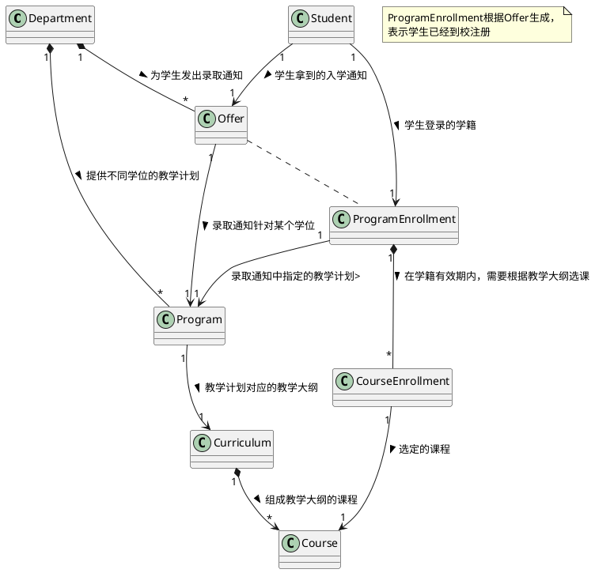

半结构化自然语言表达的模型的核心概念和应用要点是什么？

---

**写注释**：在结构化的描述中混入自然语言去补充对应的上下文。



Prompt

```text
领域模型
======
{model}

用户故事
======
{user_story}

验收场景
======
{ac}

任务
===
数据都以yaml格式给出。
首先，请根据领域模型理解用户故事中的场景，并针对验收场景中Given的部分，给出样例数据。
然后，参看验收场景中 When 的部分，给出样例数据会产生怎样的改变。
```
