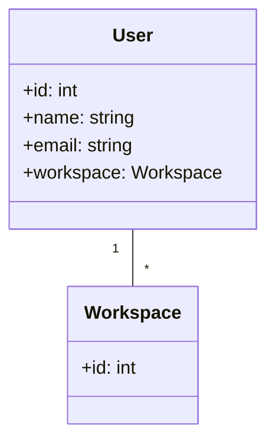

# 从最熟悉的入手

在前端开发中，用户基本信息接口是一个核心组件，用于承载和管理用户的个人信息。由于用户的个人基本信息变更频率较低，频繁的网络请求不仅会增加服务器的负担，还会影响用户体验。因此，前端开发人员通常会在初次请求后将用户信息存储在本地缓存中，如LocalStorage或SessionStorage，以减少后续请求的次数。只有在用户进行个人信息变更时，才会触发更新本地数据的逻辑。

然而，由于历史遗留问题，获取用户信息的接口设计并不理想，存在大量冗余内容。这些冗余数据不仅增加了接口的响应时间，还可能导致前端缓存的数据量过大，影响应用的性能。因此，我们需要对这一接口进行优化，通过数据精简和接口重构，减少不必要的字段，提高接口的效率和响应速度。

选择 User 接口其实还和业务模型两大难题有关
1. **没有迭代**：建模不怕差，就怕没有反馈去迭代，而基本每一个功能，都多少和 user 相关，这样可以让建模辐射到更多的人上。
2. **没有共识**：User 及其直接关联的实体，都是业务早期就定义下来的，相对来说概念分歧较少，也更好的获取团队的共识。
![[../images/Pasted image 20241008094046.png|Pasted image 20241008094046.png]]
在上面的接口信息中，`lastWsInfo` 是一个典型的冗余部分，它反映了后端在同一个接口函数中不断增添内容，导致返回的数据中包含大量与用户信息无关的内容。这种基础的 CURD 接口实现，即使不做后端开发，我们也可以推测其代码结构。例如，在 Java 中，`getUserInfo` 方法可能会调用多个子方法来获取不同的信息，如 `getBaseInfo()` 获取基本信息，`getLastWsInfo()` 获取工作区信息，以及 `getOthers()` 获取其他各种信息，最终将这些信息整合在一起返回给前端。这种设计虽然简化了后端的开发，但却导致了接口的冗余和低效。
```Java
// 整体的代码结构差不多是下面这样，多数情况下甚至不会划分成 getBaseInfo、getLastWsInfo、getOthers 子函数
class User {
	getUserInfo(){
		// 获取手机、邮箱、昵称等信息的部分
		baseInfo = getBaseInfo()
		// 获取工作区信息 lastWsInfo 的部分
		wsInfo = getLastWsInfo()
		// 获取其它各种信息的部分
		others = getOthers()
		// 将所有的信息整合在一起返回给前端
	}
}
```
从上面的接口信息，以及遗留系统中的功能，我们可以梳理出以下用户故事：
1. 作为一个用户，我希望可以加入别人的工作区，以此

概念词典

| 中文命名 | 英文命名      | 描述                      |
| ---- | --------- | ----------------------- |
| 工作区  | Workspace | 用户当前所在的工作区，一个用户可以有多个工作区 |
| 用户   | User      | 平台的用户                   |

业务模型


由于用户可以创建 / 加入多个工作区，所以 `User` 和 `Workspace` 之间是一对多的关系。

我们先构建出最原始的两个实体模型

```ts
// User
export class User {
  id: number;
  constructor(public backendUser: IBackendUser) {
    this.id = backendUser.uid;
  }

  getLastWsInfo(): WorkSpace {
    return new WorkSpace(this.backendUser.lastWsInfo);
  }
}

export interface IBackendUser {
  uid: number;
  lastWsInfo: IBackendWorkspace;
}
```

```ts
// Workspace
export class WorkSpace {
  id: number;
  constructor(private backendWorkspace: IBackendWorkspace) {
    this.id = this.backendWorkspace.wsId;
  }
}

export interface IBackendWorkspace {
  wsId: number;
}
```

我们的预期是把获取 workspace 的接口，从获取 user 接口中独立出来，那么我们会很自然的想到如下变更：

```ts
export class User {
  private httpClient = inject(HttpClient);
  id: number;
  constructor(public backendUser: IBackendUser) {
    this.id = backendUser.uid;
  }

  getLastWsInfo(): Observable<WorkSpace> {
    return this.httpClient
      .get<IBackendWorkspace>('url')
      .pipe(map((res) => new WorkSpace(res)));
  }
}
```

这样做似乎没有什么问题，`workspace` 无法独立于 `user` 存在，那么获取 `workspace` 实体的逻辑，自然应该绑定在 `user` 实体上。但是这样导致了一个很明显的问题，那就是把具体的实现逻辑，泄漏给了模型层。模型层是业务逻辑的抽象，除非业务发生变化（发现模型设计不合理往往也是由于业务变更触发的），那么它对应的逻辑，就是一个绝对稳定，不容置疑的存在。

那这个我们要如何解决呢，可以参考 Spring 的 Repository，在 angular 中，最适合的就是 service 了。我们可以构造一个 user service
```ts
// UserService
@Injectable({ providedIn: 'root' })
export class UserService {
  private httpClient = inject(HttpClient);
  
  findByUserId(uid: number): Observable<User> {
    return this.httpClient
      .get<IBackendUser>(`url`)
      .pipe(map((res) => new User(res)));
  }

  getCurrentWorkspace(user: User): Observable<WorkSpace> {
    return this.httpClient
       .get<IBackendWorkspace>(`url`)
       .pipe(map((res) => new WorkSpace(res)));
  }
}
```

那么我们获取当前用户工作区的过程，就变为了

```ts
userService
  .findByUserId(123)
  .pipe(switchMap((user) => userService.getCurrentWorkspace(user)))
  .subscribe((workspace) => console.log(workspace));
```

在这样的实现下，就完全符合视图层 -> 实现层 -> 模型层的分离了
# 没有后端支持怎么办

建模与代码优化，需要在平时开发中不断进行更新与优化。但是在多数情况下，我们都无法获取后端的支持，配合前端进行接口的拆分。但是没有关系，我们只需要在模型层简单调整下就好。

```ts
// UserService
@Injectable({ providedIn: 'root' })
export class UserService {
  private httpClient = inject(HttpClient);
  
  findByUserId(uid: number): Observable<User> {
    return this.httpClient
      .get<IBackendUser>(`url`)
      .pipe(map((res) => new User(res)));
  }

  getCurrentWorkspace(user: User): Observable<WorkSpace> {
    // return this.httpClient
    //   .get<IBackendWorkspace>(`users/${user.id}/workspaces`)
    //   .pipe(map((res) => new WorkSpace(res)));
    // 只要在后端接口实现完成后，切换成真正的接口请求就好了。
    return of(new WorkSpace(user.backendUser.lastWsInfo));
  }
}
```

这种代码变动并不会传递到模型层，调用方式依旧为

```ts
userService
  .findByUserId(123)
  .pipe(switchMap((user) => userService.getCurrentWorkspace(user)))
  .subscribe((workspace) => console.log(workspace));
```


