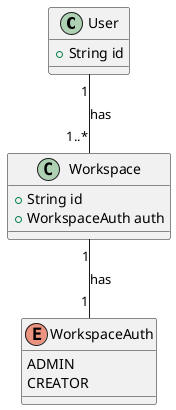
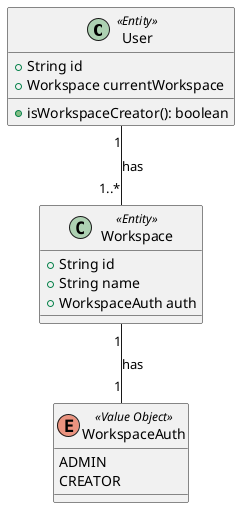

# User：熟悉的陌生人

在前端开发中，用户基本信息接口是一个核心组件，用于承载和管理用户的个人信息。由于用户的个人基本信息变更频率较低，频繁的网络请求不仅会增加服务器的负担，还会影响用户体验。因此，前端开发人员通常会在初次请求后将用户信息存储在本地缓存中，如LocalStorage或SessionStorage，以减少后续请求的次数。只有在用户进行个人信息变更时，才会触发更新本地数据的逻辑。

在一开始的时候，User 里一般只有用户名、手机号、邮箱等基础信息，后来我们为了给用户划分等级，来满足不同类型客户的需求，User 接口里就有了权限相关信息。再后来我们为了让客户能够帮我们宣传产品，我们便有了邀请机制，User 信息里便通过 `isInvited` 区分是否被邀请。随着功能的累加，User 接口变膨胀为了巨型对象。比如下面这种：

```json
{
  "beingBlackEmail": false,
  "beingDisableExpiryRemind": false,
  "beingExpand": true,
  "beingInvited": false,
  "beingLangFollowBrowser": false,
  "beingOldVersion": false,
  "beingPrivacyPolicy": true,
  "beingSandBoxSuperAdmin": false,
  "collectUserInfo": true,
  "createTime": "2022-09-05T10:00:19",
  "csShow": false,
  "desktopRemind": true,
  "email": "uat@qingflow.com",
  "firstLogin": false,
  "hasPwdLoggedIn": true,
  "havePassword": true,
  "headImg": "https://osstest.oalite.com/documents/user/icon/126B7CD/0dbf8e37-72b7-43c9-a18f-6d74ccf33d53.jpeg",
  "lang": "cn",
  "lastWsInfo": {
    "accepted": null,
    "accountLevel": 40,
    "auth": 2,
    "beingCustomizedAppSync": false,
    "beingDevelopManagement": false,
    "beingHideHelpDocument": false,
    "beingSandbox": false,
    "beingUseExternalMemberFunction": true,
    "beingWatermark": false,
    "biAuth": "NORMAL",
    "canWorkWx": false,
    "contactEnableNum": 82,
    "contactNum": 85,
    "dataRelatedStatus": "NEW",
    "departs": [
      [
        {
          "beingCanEdit": null,
          "departName": "1",
          "deptId": 279395,
          "ordinal": "-100000000",
          "userPost": 0
        },
        {
          "beingCanEdit": null,
          "departName": "89",
          "deptId": 279396,
          "ordinal": "-99965375",
          "userPost": 0
        },
        {
          "beingCanEdit": null,
          "departName": "90",
          "deptId": 279401,
          "ordinal": "-100000000",
          "userPost": 0
        },
        {
          "beingCanEdit": null,
          "departName": "54",
          "deptId": 279408,
          "ordinal": "-100002000",
          "userPost": 0
        },
        {
          "beingCanEdit": null,
          "departName": "64",
          "deptId": 279413,
          "ordinal": "-100001000",
          "userPost": 0
        },
        {
          "beingCanEdit": null,
          "departName": "79",
          "deptId": 279418,
          "ordinal": "-100001000",
          "userPost": 0
        }
      ],
      [
        {
          "beingCanEdit": null,
          "departName": "轻流",
          "deptId": 212545,
          "ordinal": "0",
          "userPost": 0
        },
        {
          "beingCanEdit": null,
          "departName": "研发部门",
          "deptId": 212546,
          "ordinal": "0",
          "userPost": 0
        }
      ],
      [
        {
          "beingCanEdit": null,
          "departName": "轻流",
          "deptId": 212545,
          "ordinal": "0",
          "userPost": 0
        }
      ],
      [
        {
          "beingCanEdit": null,
          "departName": "逐级审批部门1",
          "deptId": 279769,
          "ordinal": "9",
          "userPost": 0
        },
        {
          "beingCanEdit": null,
          "departName": "逐级审批子1",
          "deptId": 279771,
          "ordinal": "0",
          "userPost": 0
        },
        {
          "beingCanEdit": null,
          "departName": "逐级审批子2",
          "deptId": 279772,
          "ordinal": "0",
          "userPost": 1
        }
      ],
      [
        {
          "beingCanEdit": null,
          "departName": "逐级审批部门1",
          "deptId": 279769,
          "ordinal": "9",
          "userPost": 0
        },
        {
          "beingCanEdit": null,
          "departName": "逐级审批子1",
          "deptId": 279771,
          "ordinal": "0",
          "userPost": 0
        },
        {
          "beingCanEdit": null,
          "departName": "逐级审批子2",
          "deptId": 279772,
          "ordinal": "0",
          "userPost": 1
        }
      ],
      [
        {
          "beingCanEdit": null,
          "departName": "逐级审批部门1",
          "deptId": 279769,
          "ordinal": "9",
          "userPost": 0
        },
        {
          "beingCanEdit": null,
          "departName": "逐级审批子1",
          "deptId": 279771,
          "ordinal": "0",
          "userPost": 0
        },
        {
          "beingCanEdit": null,
          "departName": "逐级审批子2",
          "deptId": 279772,
          "ordinal": "0",
          "userPost": 1
        }
      ],
      [
        {
          "beingCanEdit": null,
          "departName": "逐级审批部门1",
          "deptId": 279769,
          "ordinal": "9",
          "userPost": 0
        },
        {
          "beingCanEdit": null,
          "departName": "逐级审批子1",
          "deptId": 279771,
          "ordinal": "0",
          "userPost": 0
        },
        {
          "beingCanEdit": null,
          "departName": "逐级审批子2",
          "deptId": 279772,
          "ordinal": "0",
          "userPost": 1
        }
      ],
      [
        {
          "beingCanEdit": null,
          "departName": "逐级审批部门1",
          "deptId": 279769,
          "ordinal": "9",
          "userPost": 0
        },
        {
          "beingCanEdit": null,
          "departName": "逐级审批子1",
          "deptId": 279771,
          "ordinal": "0",
          "userPost": 0
        },
        {
          "beingCanEdit": null,
          "departName": "逐级审批子2",
          "deptId": 279772,
          "ordinal": "0",
          "userPost": 1
        },
        {
          "beingCanEdit": null,
          "departName": "逐级审批子3",
          "deptId": 279773,
          "ordinal": "0",
          "userPost": 0
        }
      ],
      [
        {
          "beingCanEdit": null,
          "departName": "打印部门",
          "deptId": 279803,
          "ordinal": "13",
          "userPost": 0
        }
      ]
    ],
    "dynamic": null,
    "exId": "tAeLHd46LCKx944sDqug/A==",
    "exUserId": "1148377",
    "exWsId": "5yCfIToEVUXBj0fUn6rgWg",
    "expireDate": 1745574727000,
    "externalMemberId": null,
    "hideCopyright": false,
    "identity": "INTERIOR",
    "logoutConfig": {
      "logOutToSso": false,
      "serverName": null,
      "ssoType": null
    },
    "memberId": 1196687,
    "openConnectorList": [],
    "openPluginList": [
      2,
      3,
      4,
      6,
      7,
      8,
      9,
      11,
      12,
      13,
      14,
      15,
      16,
      17,
      18,
      19,
      20,
      21,
      22,
      23,
      24,
      25,
      26,
      27,
      28,
      29,
      33,
      34,
      35,
      36,
      37,
      38,
      39,
      41,
      42,
      43,
      44,
      45,
      46,
      -2,
      32,
      30
    ],
    "permissionStatus": false,
    "pluginClickList": [
      4,
      6,
      14,
      19,
      26,
      30,
      36,
      39,
      40,
      503,
      504,
      505,
      506
    ],
    "pluginLimitDetail": {
      "dashAllVisiableLimit": 4,
      "dashAllVisiableNum": 9
    },
    "publicAccessAuthVO": {
      "beingAttachmentQuestion": true,
      "beingPublicLink": true
    },
    "remark": "1",
    "showContact": true,
    "trial": true,
    "trialDays": "784",
    "trialNotice": true,
    "type": "workwx",
    "useScheduledSync": false,
    "watermarkConfig": {
      "showDate": true,
      "showDeparts": true,
      "showExUserId": true,
      "showName": true,
      "showPhoneNumber": true,
      "showWsName": true
    },
    "wsDomain": null,
    "wsFunction": "platform",
    "wsId": 110184,
    "wsLimitDetail": {
      "canDashNum": -1,
      "canFormNum": -1,
      "canPackageNum": -1,
      "currentDashNum": -1,
      "currentFormNum": -1,
      "currentPackageNum": -1
    },
    "wsName": "hp最大的工作区"
  },
  "mobile": "13091870868",
  "nickName": "灭霸堂堂来袭",
  "npsCollect": false,
  "promoCode": "f1d25a24a",
  "randomEmail": false,
  "recordedNewGuidePop": [
    1,
    2,
    3,
    4,
    5,
    6,
    7,
    9,
    10,
    11
  ],
  "showProcessPersonal": false,
  "signatureUrl": "https://osstest.oalite.com/documents/form/signature/126B7CD/22e2adbf-9939-4246-943f-e6ea0a00186a.png",
  "source": "offical_noPage_undefined",
  "status": true,
  "uid": 1148377
}
```

在整个 user 接口膨胀的过程中，承载了几十上百页的需求、设计文档。在当年任务开发的阶段，这些的确能准确描述当时的系统状态。然而随着时间的更迭、需求的研发，不同阶段的文档往往无法很好地保存下来，最终造成了业务知识的缺失。

即使所有文档都保存完好，也很难有人能完完整整地阅读下来。虽然现在有 AI 了，但是没有人能保证系统的实现和文档描述是完全吻合的。错误的业务知识传递，可能在 AI 的情况下比过去更加严重。
# 隐性概念显性化，降低认知负载
## 用图片代替文字

`User` 虽然复杂，但我们提取概念并不需要一步到位，我们完全可以从一些从项目初始就被顶益下来的内容入手。以常见的低代码为例子，大家都有一个常见的工作区功能，简单描述就是“我现在有一个 user 实体，一个 user 实体对应一个 workspace，workspace 对应一个 auth 值对象，用来表明当前用户是工作区管理员还是工作区创建者”。在多数情况下，这些内容只存在于我们的脑海类，对于新入职的员工来说，必须对相关功能具体使用，才会有一个感性的认知。如果写在文档内，也会带来诸如“文档更新不及时”，”文档太长看不下去“的问题。相比文字， UML 一类的流程图传递信息更高。在当前生成式 AI 流行的状态下，我们完全不需要一点点地去绘制出来。只需要再其后面增加一点 prompt:"我现在有一个 user 实体，一个 user 实体对应一个 workspace，workspace 对应一个 auth 值对象，用来表明当前用户是工作区管理员还是工作区创建者，**请将其绘制为 PLANT UML，并标注是实体还是值对象**"

经过 deepseek 的帮忙，并，我们可以得到如下最基础的模型图。


# 用值对象代替枚举

在我们平时的代码中，我们会在每一个用到权限的地方，进行类似于如下判断代码。
```js
const workspace = this.globalUser.workspaceInfo();
const auth = workspace?.auth;

return auth === UserWsAuth.CREATOR;
```
尽管我们可以将判断逻辑抽象至一个  util 函数中，比如 `WsAuthUtil.isCreater(auth)`（实际上大部分企业都是这么做的）。但这个方式治标不治本。对于用户故事 “当用户是工作区管理员时，用户可以邀请别人”，最能体现业务的描述应该是：
```js
if (user.isWorkspaceCreater()) {
	user.invite()
}
```
而不是：
```js
if (WsAuthUtil.isCreater(auth)) {
	user.invite()
}
```

第二种方法中 `WsAuthUtil.isCreater(auth)` 它本身只是一些静态方法的集合，这种方法虽然实现了功能，但是并没有明确表达出**用户工作区权限**这个业务概念。而且每一个初次上手代码库的人，我们除了知道用户可以作为工作区管理员这一信息外，还必须知道**代码库中存在一个叫做 `WsAuthUtil` 的工具类**。这对于代码的学习者来说，是一个额外且不必要的负担。如果在某一次信息传递出现问题，没有明确告知 `WsAuthUtil`工具类的存在，又会在各种地方出现功能类似，写法不同的重复代码。

在上面的例子中，我们发现，枚举值是一个几乎难以传递信息的代码形式。它只能作为权限的标识符，不能体现权限本身的概念，基于 DDD 的思想，我们构造一个叫做 `UserAuth` 的值对象，将各种判断条件写入值对象中，这样在实现层就不需要写大量的判断了。

```ts
enum WorkspaceAuthEnum {
  MEMBER,
  ADMIN,
  CREATOR,
  DATA_MANAGER,
}

export class WorkspaceAuth {
  private constructor(
    private params: { label: string; value: WorkspaceAuthEnum }
  ) {
    this.label = this.params.label;
    this.value = this.params.value;
  }

  readonly label!: string;
  
  readonly value!: WorkspaceAuthEnum;

  static readonly MEMBER = new WorkspaceAuth({
    label: '工作区成员',
    value: WorkspaceAuthEnum.MEMBER,
  });

  static readonly ADMIN = new WorkspaceAuth({
    label: '工作区管理员',
    value: WorkspaceAuthEnum.ADMIN,
  });

  static readonly CREATOR = new WorkspaceAuth({
    label: '工作区创建者',
    value: WorkspaceAuthEnum.CREATOR,
  });

  static values(): WorkspaceAuth[] {
    return Object.values(this).filter((item) => item instanceof WorkspaceAuth);
  }

  static valueOf(value: WorkspaceAuthEnum): WorkspaceAuth {
    const WorkspaceAuth = this.values().find((item) => item.value === value);
    if (!WorkspaceAuth) {
      throw new Error(`未知的工作区权限 ${value}`);
    }
    return WorkspaceAuth;
  }
}
```

接下去我们在构造 user 和 workspace 实体时，使用 `userAuth` 值对象，在 user 中的权限数据就变为了：
```ts
import { WorkspaceAuth } from './workspace-auth';

export interface BackendWorkspace {
  auth: WorkspaceAuth['value'];
}

export class Workspace {
  constructor(private backendWorkspace: BackendWorkspace) {}

  get auth(): WorkspaceAuth {
    return WorkspaceAuth.valueOf(this.backendWorkspace.auth);
  }
}
```

```ts
import { WorkspaceAuth } from '../workspace';
import { type BackendWorkspace, Workspace } from '../workspace/workspace';

export interface BackendUser {
  id: number;
  currentWorkspace: BackendWorkspace;
}

export class User {
  constructor(private backendUser: BackendUser) {
    this.id = this.backendUser.id;
    this.currentWorkspace = new Workspace(this.backendUser.currentWorkspace);
  }

  id: number;
  currentWorkspace: Workspace;

  isWorkspaceCreator(): boolean {
    return this.currentWorkspace.auth === WorkspaceAuth.CREATOR;
  }
}
```
在这样的设计下，判断用户是否是工作区管理员，就变为了：
```ts
user.isWorkspaceCreator()
```
如果我们想知道用户当前工作区权限的具体信息，只需要：
```ts
user.currentWorkspace.auth
```
# 显性概念隐性化，快速信息传递

到这里为止，其实我们碰到了很多人落地业务建模第一个忽略的点，那就是代码变更后，并没有同步至模型中。这也是多数人落地业务建模时，虽然在考评里写的很多，但从结果上来说，只是在遗留系统之外，由写了一个隐藏大量业务知识的遗留系统。后续开发者的维护成本可想而知。我们现在重新更新一下模型：


