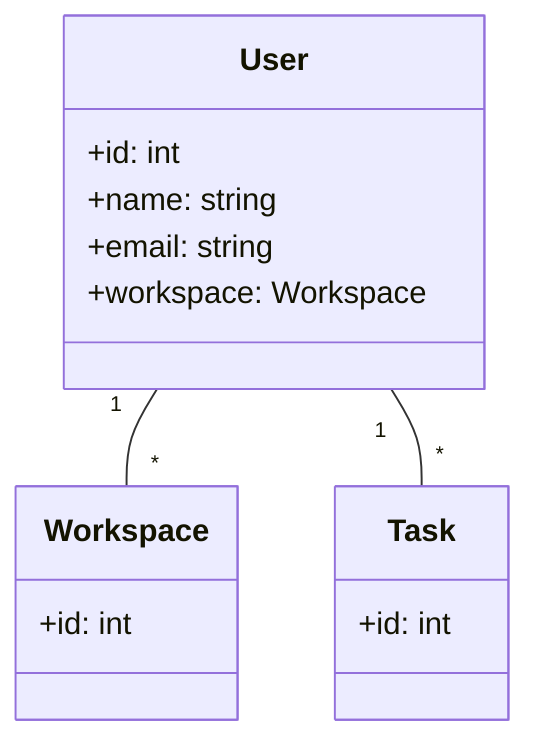

# 列表请求应该放在哪

当用户登陆系统后，有一个最直接的需求：“作为一个用户，我可以获取到所有的应用的任务列表，以此快速查询到我想要的任务数据。” 大概功能入下图所示。
.png)
现在，我们基于用户故事更新一下业务模型



我们可以看到，用户和任务之间也是是一对多的关系，我们的现实场景下，代码设计大概如下。如果移动端用户有同样的需求，那就写一个差不多的代码过去。

```ts
@Component({
  selector: 'app-tasks',
  standalone: true,
  template: '<div *ngFor="let item of tasks()">{{item}}</div>',
  changeDetection: ChangeDetectionStrategy.OnPush,
  imports: [NgFor],
})
  export class TasksComponent implements OnInit {
    private destoryRef = inject(DestroyRef);

    tasks = signal<Task[]>([]);

    getTasks(): Observable<Task[]> {
      return of([]);
    }

    ngOnInit(): void {
      this.getTasks()
        .pipe(takeUntilDestroyed(this.destoryRef))
        .subscribe((tasks) => {
          this.tasks.set(tasks);
        });
    }

    // 筛选
    filter():void{}

    // 搜索
    search(): void {}

    // 总数
    total(): void

    // 已读全部
    readAll(): void {}
  }
```

在上述代码中，`TasksComponent` 类随着业务需求的增加逐渐变得臃肿，导致代码难以维护和扩展。最初，该组件仅负责显示任务列表，但随着时间的推移，用户需求不断增加，如搜索、筛选、统计总数、标记已读等功能被逐一添加。这些功能的实现代码被直接嵌入到 `TasksComponent` 中，使得该类变得越来越庞大，职责不明确，逻辑复杂度急剧上升。

这种“过长类”（God Class）的设计模式违反了单一职责原则（SRP），即一个类应该只有一个引起它变化的原因。随着功能的增加，`TasksComponent` 不仅负责数据获取和展示，还承担了搜索、筛选、统计等业务逻辑，导致代码耦合度高，难以理解和修改。当团队成员变动时，新成员需要花费大量时间理解复杂的代码逻辑，甚至可能因为害怕破坏现有功能而不敢进行修改，最终导致代码的可维护性急剧下降。

比如像下图中的 footer 由于不同客户的需求叠加，控制了复数的按钮现隐藏，甚至可以累积近 2000 行。在这种场景下进行所谓的拆解和预估工时已经完全没有意义了，只能先满足功能，再由测试手动验证，至于会不会造成什么问题，完全交给测试手动回归。这种场景各位在阅读本文的时候，说不准就在经历。


按照之前的代码设计描述业务的要求，我们可以很自然地构建出以下模型。

```ts
import { Injectable } from '@angular/core';
import { Task } from './task';

class User {
  private tasks: Task[] = [];

  public getTasks(): Obervable {
	 // httprequest
  }
}
```

这是一个很糟糕的实现，因为我们把获取请求的具体实现细节引入到了领域逻辑中，因而无法保持领域逻辑的的独立性。那么我们能不能给获取任务列表，单独提供一个对象呢？比如：

```ts
interface TasksService {
	load(pageSize: number, pageNum: number): Observable<Task[]>
}
```

其实也不行，Task 应该被 User 聚合。那么为了保证 User 是 “逻辑丰富” 的模型，我们希望通过 User 聚合根获取 Task 列表，而直接对外暴露获取任务列表的对象，相当于把模型中不存在的内容泄漏了出去。

这种两难的局面根源在于，**我们希望在模型中使用集合接口，并借助它封装具体技术实现的细节**。
# 关联对象：体现关联关系

**关联对象**。即**将对象间的关联关系直接建模出来，再通过接口与抽象的隔离，把具体的实现细节封装到接口的实现中**。这样既可以保证概念上的统一，又能够避免技术实现上的限制。

这样解决了第一个问题，就是用一套逻辑，保证了 pc 端，mobile 端，两边的行为一致性。我们也的确达成了最开始模型层
但是在上述内容中，我们还要防止过长类的出现。很简单，将 user 和 tasks 之间的关系，看作一个整体。抽象至一个单独的类中。至于命名，我们可以直接将 2 个实体名称拼接起来，在构建统一语言时，在根据与业务的沟通，使其变得更加语义化，比如 MyTasks，现在我们先简单拼接为 UserTasks 。
## 使用关联对象体现聚合关系
```ts
import { Observable } from 'rxjs';
import { IBackendWorkspace, WorkSpace } from './workspace';
import { Task } from './task';

export interface IBackendUser {
  uid: number;
  lastWsInfo: IBackendWorkspace;
}

export class User {
  id: number;
  constructor(public backendUser: IBackendUser) {
    this.id = backendUser.uid;
  }
}

export interface IUserTasks {
  load: () => Observable<Task[]>;
  filter: () => void;
  search: () => void;
  readAll: () => void;
}

export interface IUserService {
  findByUserId: (uid: number) => Observable<User>;

  getCurrentWorkspace: (user: User) => Observable<WorkSpace>;

  getUserTasks: (user: User) => IUserTasks;
}
```
#### 增添 usertasks 的实现层
```ts
import { HttpClient } from '@angular/common/http';
import {
  inject,
  Injectable,
  Injector,
  runInInjectionContext,
} from '@angular/core';
import { map, Observable } from 'rxjs';
import { IBackendTask, Task } from 'src/models/task';
import { IUserTasks, User } from 'src/models/user';

@Injectable({ providedIn: 'root' })
export class UserTasksService {
  private injector = inject(Injector);
  createUserTasks(user: User): IUserTasks {
    return runInInjectionContext(this.injector, () => new UserTasks(user));
  }
}

class UserTasks implements IUserTasks {
  private httpClient = inject(HttpClient);

  constructor(private user: User) {}

  load(): Observable<Task[]> {
    return this.httpClient
      .get<IBackendTask[]>(`users/${this.user.id}/tasks`)
      .pipe(map((res) => res.map((item) => new Task(item))));
  }

  filter() {}

  readAll() {}

  search() {}
}
```
#### 更新 user 的实现层

```ts
import { HttpClient } from '@angular/common/http';
import { inject, Injectable } from '@angular/core';
import { map, Observable, of, switchMap } from 'rxjs';
import { IBackendUser, IUserService, IUserTasks, User } from 'src/models/user';
import { WorkSpace } from 'src/models/workspace';
import { UserTasksService } from './user-tasks.service';

@Injectable({ providedIn: 'root' })
export class UserService implements IUserService {
  private httpClient = inject(HttpClient);
  private userTasksService = inject(UserTasksService);

  findByUserId(uid: number): Observable<User> {
    return this.httpClient
      .get<IBackendUser>(`users/${uid}`)
      .pipe(map((res) => new User(res)));
  }

  getCurrentWorkspace(user: User): Observable<WorkSpace> {
    // return this.httpClient
    //   .get<IBackendWorkspace>(`users/${user.id}/workspaces`)
    //   .pipe(map((res) => new WorkSpace(res)));
    return of(new WorkSpace(user.backendUser.lastWsInfo));
  }

  getUserTasks(user: User): IUserTasks {
    return this.userTasksService.createUserTasks(user);
  }
}
```

最终在模型指导下获取数据，就变成了下面的代码。如果用通用语言来描述，那就是“获取某一个用户信息后，根据用户信息，获取当前用户下的所有任务列表”。这样既保证了业务行为的一致性，由保证了代码的可读性。
```ts
const userService = inject(UserService);
userService.findByUserId(123).subscribe((user) => {
  const userTasks = userService.getUserTasks(user);
  userTasks.load();
  userTasks.filter();
});
```

#### 更好的技术实现隔离

引入关联对象，我们可以更好地隔离领域逻辑和技术实现细节。 还是在当前的例子上来解释。
由于后端进行重构，或者前端通过 BFF 进行了数据的聚合，导致新返回的数据有了较大的 break change。那么，我们只需要提供另一个 `IUserTasks` 的实现就可以了


```ts
class UserTasks implements IUserTasks {
  private httpClient = inject(HttpClient);

  constructor(private user: User) {}

  load(): Observable<Task[]> {
    return this.httpClient
      .get<IBackendTask[]>(...)
      .pipe(map((res) => res.map((item) => new Task(item))));
  }

  filter() {}

  readAll() {}

  search() {}
}
```

这种改变并不会传递到接口层，对于根据用户获取任务列表的调用依然为

```ts
const userService = inject(UserService);
userService.findByUserId(123).subscribe((user) => {
  const userTasks = userService.getUserTasks(user);
  userTasks.load();
  userTasks.filter();
});
```
不论后端 api 如何变更，这些变化都完全被关联对象的接口封装隔离了。我们使用自定义关联对象，去描述列表的行为，就和使用 class 描述实体与值对象一样，真正把行为封装到了接口之上。