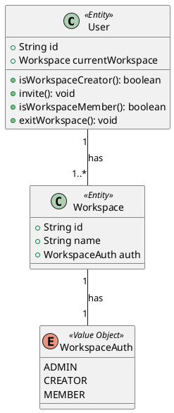

在上一讲中，我们讲到一个用户故事：“当用户是工作区管理员时，用户可以邀请别人”，现在我们新增一个用户故事“当用户时工作区成员时，用户可以退出当前工作区”。我们更新一下业务模型：

```plantuml
@startuml
class User <<Entity>> {
    +String id
    +Workspace currentWorkspace
    +isWorkspaceCreator(): boolean
    +invite(): void
    +isWorkspaceMember(): boolean
    +exitWorkspace(): void
}

class Workspace <<Entity>> {
    +String id
    +String name
    +WorkspaceAuth auth
}

enum WorkspaceAuth <<Value Object>> {
    ADMIN
    CREATOR
    MEMBER
}

User "1" -- "1..*" Workspace : has
Workspace "1" -- "1" WorkspaceAuth : has
@enduml
```

对于一个创业开发者，在一开始单打独斗的时候，必须
